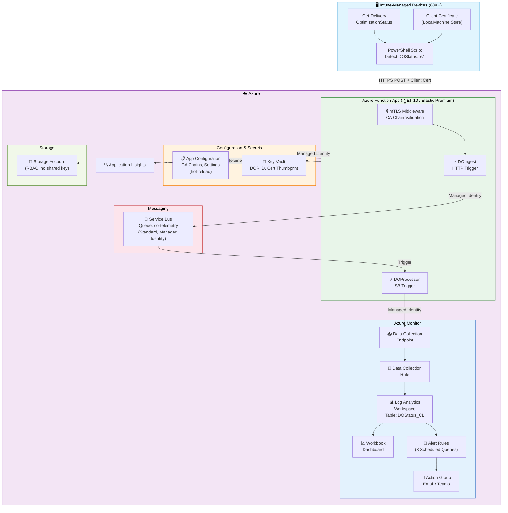
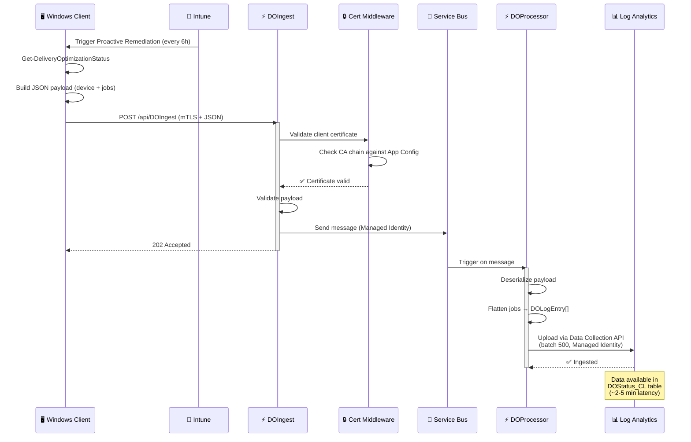
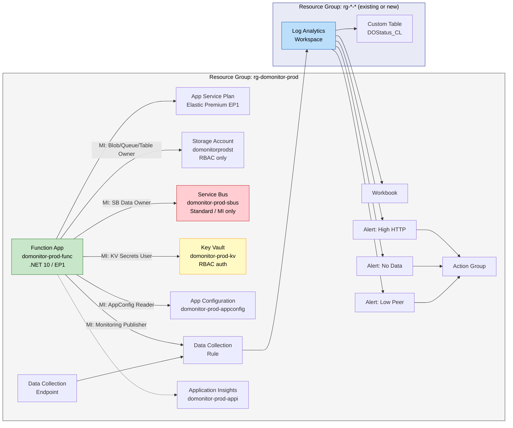
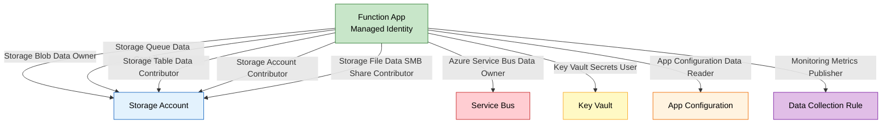

# DO-Monitor — Architecture Diagrams

## High-Level Architecture

```mermaid
flowchart TB
    subgraph Clients["🖥️ Intune-Managed Devices (60K+)"]
        PS["PowerShell Script<br/>Detect-DOStatus.ps1"]
        DO["Get-Delivery<br/>OptimizationStatus"]
        CERT["Client Certificate<br/>(LocalMachine Store)"]
        DO --> PS
        CERT --> PS
    end

    subgraph Azure["☁️ Azure"]
        subgraph FuncApp["Azure Function App (.NET 10 / Elastic Premium)"]
            MW["🔒 mTLS Middleware<br/>CA Chain Validation"]
            INGEST["⚡ DOIngest<br/>HTTP Trigger"]
            PROC["⚡ DOProcessor<br/>SB Trigger"]
            MW --> INGEST
        end

        subgraph Config["Configuration & Secrets"]
            AC["📋 App Configuration<br/>CA Chains, Settings<br/>(hot-reload)"]
            KV["🔑 Key Vault<br/>DCR ID, Cert Thumbprint"]
        end

        subgraph Messaging["Messaging"]
            SB["📨 Service Bus<br/>Queue: do-telemetry<br/>(Standard, Managed Identity)"]
        end

        subgraph Analytics["Azure Monitor"]
            DCE["📥 Data Collection<br/>Endpoint"]
            DCR["📐 Data Collection<br/>Rule"]
            LAW["📊 Log Analytics<br/>Workspace<br/>Table: DOStatus_CL"]
            WB["📈 Workbook<br/>Dashboard"]
            AR["🚨 Alert Rules<br/>(3 Scheduled Queries)"]
            AG["📧 Action Group<br/>Email / Teams"]
        end

        subgraph Storage["Storage"]
            ST["💾 Storage Account<br/>(RBAC, no shared key)"]
        end

        AI["🔍 Application Insights"]
    end

    PS -- "HTTPS POST + Client Cert" --> MW
    INGEST -- "Managed Identity" --> SB
    SB -- "Trigger" --> PROC
    PROC -- "Managed Identity" --> DCE
    DCE --> DCR --> LAW
    LAW --> WB
    LAW --> AR
    AR --> AG
    FuncApp -. "Managed Identity" .-> AC
    FuncApp -. "Managed Identity" .-> KV
    FuncApp -. "Managed Identity" .-> ST
    FuncApp -. "Telemetry" .-> AI

    style Clients fill:#e1f5fe,stroke:#0288d1,color:#000
    style Azure fill:#f3e5f5,stroke:#7b1fa2,color:#000
    style FuncApp fill:#e8f5e9,stroke:#388e3c,color:#000
    style Config fill:#fff3e0,stroke:#f57c00,color:#000
    style Messaging fill:#fce4ec,stroke:#c62828,color:#000
    style Analytics fill:#e3f2fd,stroke:#1565c0,color:#000
    style Storage fill:#f1f8e9,stroke:#558b2f,color:#000
```

---

## Data Flow

```mermaid
sequenceDiagram
    participant Client as 🖥️ Windows Client
    participant Intune as 📱 Intune
    participant Func as ⚡ DOIngest
    participant MW as 🔒 Cert Middleware
    participant SB as 📨 Service Bus
    participant Proc as ⚡ DOProcessor
    participant LA as 📊 Log Analytics

    Intune->>Client: Trigger Proactive Remediation (every 6h)
    Client->>Client: Get-DeliveryOptimizationStatus
    Client->>Client: Build JSON payload (device + jobs)
    Client->>Func: POST /api/DOIngest (mTLS + JSON)

    activate Func
    Func->>MW: Validate client certificate
    MW->>MW: Check CA chain against App Config
    MW-->>Func: ✅ Certificate valid

    Func->>Func: Validate payload
    Func->>SB: Send message (Managed Identity)
    Func-->>Client: 202 Accepted
    deactivate Func

    SB->>Proc: Trigger on message
    activate Proc
    Proc->>Proc: Deserialize payload
    Proc->>Proc: Flatten jobs → DOLogEntry[]
    Proc->>LA: Upload via Data Collection API<br/>(batch 500, Managed Identity)
    LA-->>Proc: ✅ Ingested
    deactivate Proc

    Note over LA: Data available in<br/>DOStatus_CL table<br/>(~2-5 min latency)
```

---

## Infrastructure Components

```mermaid
graph LR
    subgraph RG["Resource Group: rg-domonitor-prod"]
        FUNC["Function App<br/>domonitor-prod-func<br/>.NET 10 / EP1"]
        PLAN["App Service Plan<br/>Elastic Premium EP1"]
        ST["Storage Account<br/>domonitorprodst<br/>RBAC only"]
        SB["Service Bus<br/>domonitor-prod-sbus<br/>Standard / MI only"]
        KV["Key Vault<br/>domonitor-prod-kv<br/>RBAC auth"]
        AC["App Configuration<br/>domonitor-prod-appconfig"]
        DCE["Data Collection<br/>Endpoint"]
        DCR["Data Collection<br/>Rule"]
        AI["Application Insights<br/>domonitor-prod-appi"]
        WB["Workbook"]
        ALR1["Alert: High HTTP"]
        ALR2["Alert: No Data"]
        ALR3["Alert: Low Peer"]
        AG["Action Group"]
    end

    subgraph WSRG["Resource Group: rg-*-* (existing or new)"]
        LAW["Log Analytics<br/>Workspace"]
        TBL["Custom Table<br/>DOStatus_CL"]
    end

    FUNC --> PLAN
    FUNC -- "MI: Blob/Queue/Table Owner" --> ST
    FUNC -- "MI: SB Data Owner" --> SB
    FUNC -- "MI: KV Secrets User" --> KV
    FUNC -- "MI: AppConfig Reader" --> AC
    FUNC -- "MI: Monitoring Publisher" --> DCR
    FUNC -.-> AI
    DCE --> DCR
    DCR --> LAW
    LAW --> TBL
    LAW --> WB
    LAW --> ALR1
    LAW --> ALR2
    LAW --> ALR3
    ALR1 --> AG
    ALR2 --> AG
    ALR3 --> AG

    style RG fill:#f5f5f5,stroke:#424242,color:#000
    style WSRG fill:#e8eaf6,stroke:#283593,color:#000
    style FUNC fill:#c8e6c9,stroke:#2e7d32,color:#000
    style KV fill:#fff9c4,stroke:#f9a825,color:#000
    style SB fill:#ffcdd2,stroke:#c62828,color:#000
    style LAW fill:#bbdefb,stroke:#1565c0,color:#000
```

---

## RBAC Role Assignments

```mermaid
graph TD
    MI["Function App<br/>Managed Identity"]

    MI -- "Storage Blob Data Owner" --> ST["Storage Account"]
    MI -- "Storage Queue Data Contributor" --> ST
    MI -- "Storage Table Data Contributor" --> ST
    MI -- "Storage Account Contributor" --> ST
    MI -- "Storage File Data SMB Share Contributor" --> ST
    MI -- "Azure Service Bus Data Owner" --> SB["Service Bus"]
    MI -- "Key Vault Secrets User" --> KV["Key Vault"]
    MI -- "App Configuration Data Reader" --> AC["App Configuration"]
    MI -- "Monitoring Metrics Publisher" --> DCR["Data Collection Rule"]

    style MI fill:#c8e6c9,stroke:#2e7d32,color:#000
    style ST fill:#e3f2fd,stroke:#1565c0,color:#000
    style SB fill:#ffcdd2,stroke:#c62828,color:#000
    style KV fill:#fff9c4,stroke:#f9a825,color:#000
    style AC fill:#fff3e0,stroke:#ef6c00,color:#000
    style DCR fill:#e1bee7,stroke:#7b1fa2,color:#000
```

---

## Deployment Pipeline

```mermaid
flowchart LR
    C["📝 Config.ps1<br/>Edit parameters"] --> S1

    subgraph Pipeline["Deploy-All.ps1"]
        S1["Step 1<br/>Deploy Infrastructure<br/>(Bicep)"]
        S2["Step 2<br/>Seed App Configuration"]
        S3["Step 3<br/>Build & Publish<br/>Functions (.NET 10)"]
        S4["Step 4<br/>Deploy Monitoring<br/>(Workbook + Alerts)"]
        S5["Step 5<br/>Generate Client Script<br/>(-CertThumbprint)"]
        S6["Step 6<br/>Validate E2E<br/>(-SendTestPayload)"]

        S1 --> S2 --> S3 --> S4 --> S5 --> S6
    end

    S6 --> CA["🔐 Manage CA Chains<br/>Manage-TrustedCAChains.ps1"]
    CA --> INTUNE["📱 Upload to Intune<br/>Detect-DOStatus-READY.ps1"]

    style Pipeline fill:#e8f5e9,stroke:#388e3c,color:#000
    style C fill:#fff3e0,stroke:#ef6c00,color:#000
    style CA fill:#fff9c4,stroke:#f9a825,color:#000
    style INTUNE fill:#e3f2fd,stroke:#1565c0,color:#000
```
